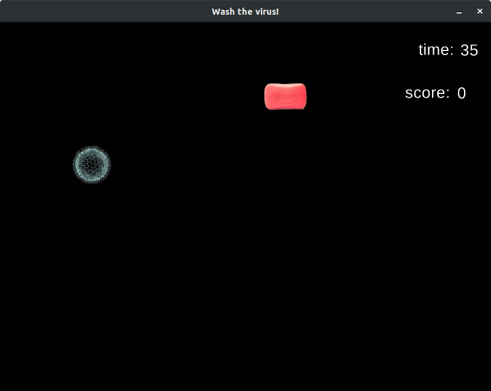

> Wash the virus as many times as you can during 60 seconds.

# Built with

- Ruby, Gosu

# Setup

- Clone repo to your machine
- Install [Ruby](https://www.ruby-lang.org/en/downloads/)
- Run `gem install bundler` and then `bundle install` to install the Gosu gem from the gemfile, or just run `gem install gosu` from the command line.
- Open containing folder in CLI and run `ruby wash_the_virus.rb`

# Gameplay

- Wash the virus as many times as you can during the given time. Careful as your score drops every time you miss.

# Testing

- Install rubocop by running `gem install rubocop` in the terminal.
- Test by running `rubocop` in the terminal.

# Acknowledgements

- A very big thank you to Mark Sobkowitz for the [book](https://pragprog.com/book/msgpkids/learn-game-programming-with-ruby)

# Future features

- Multiplayer
- Lasting scoreboard
- Power-ups
